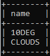

# Viikko 2 - Yhteen taulukkoon kohdistuvat kyselyt ja where-osan liitosehto

## Tehtävä 1 - Yhteen taulukkoon kohdistuvat kyselyt harjoitus

### 1.

SELECT * FROM goal;  

### 2.

SELECT name, type FROM airport WHERE iso_country = "FI";  

### 3.

SELECT name FROM airport WHERE iso_country = "FI" ORDER BY name ASC;  

### 4.

SELECT name, type FROM airport WHERE iso_country = "FI" ORDER BY type ASC, name ASC;  

### 5.

SELECT name FROM country WHERE name LIKE "f%";  

### 6.

SELECT name FROM country WHERE name LIKE "%f%";  

### 7.

SELECT ident AS location FROM airport WHERE ident = "EGCC";  

## 8.

SELECT co2_consumed FROM game WHERE co2_consumed = 8000;  

### 9.

SELECT co2_budget FROM game LIMIT 1;  

## Tehtävä 2 - Where-osan liitosehto harjoitukset

### 1.

SELECT country.name AS "country name", airport.name AS "airport name" FROM airport, country WHERE country.name = "iceland" AND airport.iso_country = country.iso_country;  

### 2.

SELECT airport.name AS "airport name" FROM airport, country WHERE country.name = "France" AND airport.iso_country = country.iso_country AND airport.type = "large_airport";  

### 3.

SELECT country.name AS "country_name", airport.name AS "airport_name" FROM airport, country WHERE country.continent = "AN" AND airport.iso_country = country.iso_country;  

### 4.

SELECT airport.elevation_ft FROM airport, game WHERE game.screen_name = "Heini" AND airport.ident = game.location;

### 5.

SELECT airport.elevation_ft * 0.3048 AS "elevation_m" FROM airport, game WHERE game.screen_name = "Heini" AND airport.ident = game.location;  

### 6.

SELECT airport.name FROM airport, game WHERE game.screen_name = "Ilkka" AND airport.ident = game.location;  

### 7.

SELECT country.name FROM country, game, airport WHERE game.screen_name = "Ilkka" AND game.location = airport.ident and airport.iso_country = country.iso_country;  

## 8.

SELECT goal.name FROM goal, goal_reached, game WHERE game.screen_name = "Heini" AND goal_reached.game_id = game.id AND goal.id = goal_reached.goal_id;  

### 9.

SELECT airport.name FROM goal, goal_reached, game, airport WHERE game.screen_name = "Ilkka" AND goal_reached.game_id = game.id AND goal.id = goal_reached.goal_id AND goal.name = "Clouds" AND airport.ident = game.location;  

### 10.

SELECT country.name FROM game, airport, country, goal, goal_reached WHERE game.screen_name = "Ilkka" AND goal_reached.game_id = game.id AND goal.id = goal_reached.goal_id AND goal.name = "clouds" AND airport.ident = game.location AND country.iso_country = airport.iso_country;  
