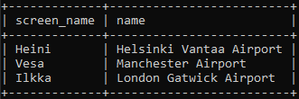

# Viikko 3 - Join ja sisäkyselyt

## Tehtävä 1 - Join harjoitukset

### 1.

```sql
SELECT country.name AS "country name", 
airport.name AS "airport name" 
FROM airport 
INNER JOIN country ON airport.iso_country = country.iso_country 
WHERE airport.scheduled_service = "yes" 
AND country.name = "Finland";  
```


### 2.

```sql
SELECT game.screen_name, airport.name 
FROM airport 
INNER JOIN game ON airport.ident = game.location;
```



### 3.

```sql
SELECT game.screen_name, country.name 
FROM airport INNER JOIN game ON game.location = airport.ident 
INNER JOIN country ON country.iso_country = airport.iso_country;
```


### 4.

```sql
SELECT airport.name, game.screen_name 
FROM airport LEFT JOIN game ON game.location = airport.ident 
WHERE airport.name LIKE "%Hels%";
```


### 5.

```sql
SELECT goal.name, game.screen_name 
FROM goal 
LEFT JOIN goal_reached ON goal.id = goal_reached.goal_id 
LEFT JOIN game ON goal_reached.game_id = game.id;
```
