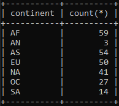
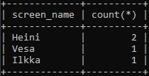

# Viikko 4 - Koostetietokyselyt ja päivityskyselyt

## Tehtävä 1 - Koostetieto kyselyt harjoitukset

### 1.

```sql
SELECT max(elevation_ft) FROM airport;
```


### 2.

```sql
SELECT continent, count(*) FROM country GROUP BY continent;
```



### 3.

```sql
SELECT game.screen_name, count(*) 
FROM goal_reached 
INNER JOIN game ON game.id = goal_reached.game_id 
GROUP BY goal_reached.game_id
ORDER BY game.screen_name;
```



### 4.

```SQL
SELECT screen_name
FROM game
WHERE co2_consumed IN (
  SELECT MIN(co2_consumed) FROM game
);
```


### 5.

```sql
SELECT country.name, count(*) 
FROM airport 
INNER JOIN country ON country.iso_country = airport.iso_country 
GROUP BY country.name 
ORDER BY count(*) DESC, country.name ASC LIMIT 50;
```


### 6.

```sql
SELECT country.name
FROM airport 
INNER JOIN country ON country.iso_country = airport.iso_country 
GROUP BY country.iso_country 
HAVING COUNT(*) >= 1000;
```


### 7.

```sql
SELECT name FROM airport WHERE elevation_ft IN (
  SELECT max(elevation_ft) FROM airport
);
```


### 8.

```sql
SELECT country.name FROM country 
INNER JOIN airport ON airport.iso_country = country.iso_country 
WHERE airport.elevation_ft IN (
  SELECT max(elevation_ft) FROM airport
);
```


### 9.

```sql
SELECT count(*) 
FROM goal_reached 
RIGHT JOIN game ON goal_reached.game_id = game.id 
WHERE game.screen_name = "Vesa";
```


### 10.

```sql
SELECT name FROM airport WHERE latitude_deg IN (
  SELECT min(latitude_deg) FROM airport
);
```


## Tehtävä 2 - Päivityskyselyt harjoitukset


### 1.

```sql
UPDATE game 
SET location = (SELECT ident FROM airport WHERE name = "Nottingham Airport")
WHERE screen_name = "Vesa";

UPDATE game 
SET co2_consumed = co2_consumed + 500 
WHERE screen_name = "Vesa";
```


### 3.

```sql
DELETE FROM goal_reached;
```


### 4.

```sql
DELETE FROM game;
```
